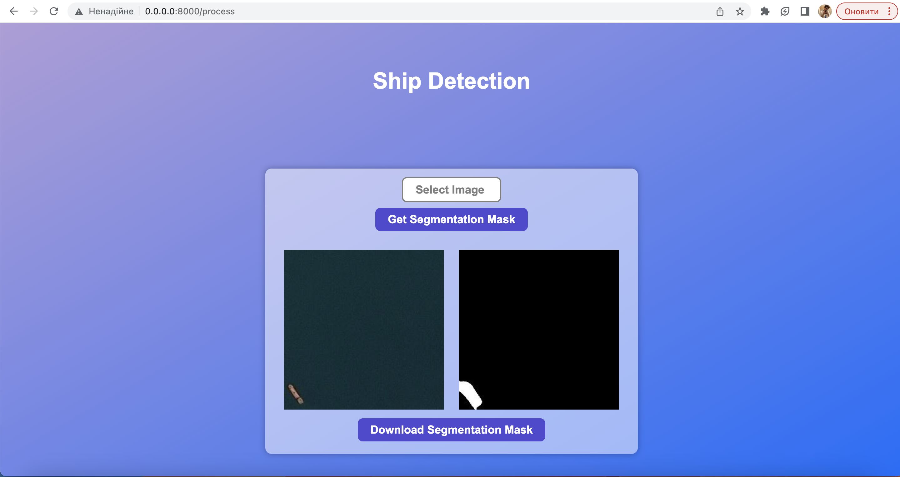
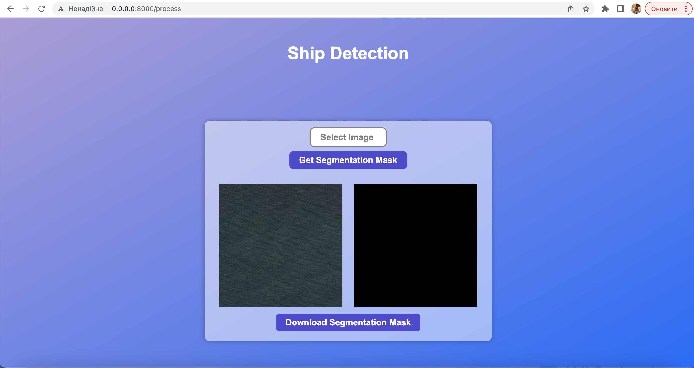

# Ship Detection

---

This repository contains modules with trained U-Net architecture for solving image segmentation problem presented in [Airbus Ship Detection Challenge](https://www.kaggle.com/c/airbus-ship-detection/overview) as well as simple web-application proposing interactive demo of the model. Let us discuss the directories in more details.

## `model`

---

This directory containes modules constructing, training and inferencing the model. First of all, in `EDA.ipynb`, one may find, as the name suggests, exploratory data analysis with the main emphasis made on the imbalance of chosen dataset and thus recommendation on reducing dataset to grasp more foreground of masks (ships).

In `dataset.py`, the transformation from run-length encode format (RLE) of masks to matrix-view is performed along with the definition of dataset generator using `keras.utils.Sequence` as base class. Also, the image size was reduced here from (768, 768) to (256, 256) due to the computational limitations of local training. One might change the shape here ot consider training on full-resolution images.

In `model.py`, the architecture of the model is presented as stated in the [classical U-Net paper](https://arxiv.org/abs/1505.04597) with slight modification on the input and output layers to fit dataset shape (as well as the number of applied convolutions, reducing their number thus reducing the number of parameters).

In `train.py`, the training pipline is set up with additional callbacks including early stopping, wandb monitoring, reduce of learning rate, checkpoint save in `.h5` format and optimizer choice. Moreover, in `train_utils.py` additional functions are implemented: weighted binary cross-entropy loss (to deal with imbalance, more attention is pointed towards segmentation mask incorrected prediction, or, simply, false negative cases). Dice score calculation is also implemented here.

In `predict.py` one can find simple procedure for prediction implementation with the hard margin being set up at the level of 0.5.

In `evaluate.py` accuracy and dice scores calculations are wrapped up in the function.

All together is being combined and used in module `interactive_model.ipynb` with the presented results on the test dataset.

## `app`

---

This directory is devoted to the web-demo of the model. In `main.py`, with the usage of FastAPI and uvicorn, one can find the endpoints implementation which make use of additional prediction functions which locate in `predict.py`. In `templates` folder, the `html`, `css` and extra `js` defitions are located.

## `config`

---

This directory contains requirements text files with needed dependecies to successfully run the model block or the app one.

## `Web-Application Setup`

---

In order to run the application, one should follow simple enough procedure.

1. Get docker on your desired computational resource.
2. Run `bash build_image_app.sh` being in the main folder. This file contains bash-script to build the app image from `Dockerfile` definition in `docker/app`.
3. Run `docker compose up` being in the main folder. This file defines what docker images should be activated (only the app one).
4. Voila! Get on `0.0.0.0:8000` and enjoy the solution!

Here is the example result of the web-application.

